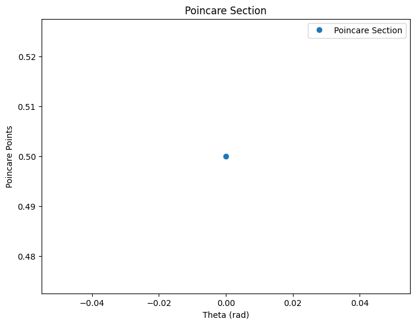

# Problem 2
# **Problem 2: Investigating the Dynamics of a Forced Damped Pendulum**

---

## **1. Theoretical Foundation**

### **Governing Equation**
The motion of a forced damped pendulum is described by the nonlinear differential equation:

\[
\frac{d^2\theta}{dt^2} + \gamma \frac{d\theta}{dt} + \omega_0^2 \sin\theta = A \cos(\omega t)
\]

where:
- \( \theta \) is the angular displacement,
- \( \gamma \) is the damping coefficient,
- \( \omega_0^2 = g/L \) is the natural frequency squared (\( L \) is the pendulum length, \( g \) is gravity),
- \( A \) is the amplitude of the external driving force,
- \( \omega \) is the driving frequency.

### **Small-Angle Approximation**
For small angles (\( \theta \approx \sin\theta \)), the equation simplifies to:

\[
\frac{d^2\theta}{dt^2} + \gamma \frac{d\theta}{dt} + \omega_0^2 \theta = A \cos(\omega t)
\]

This is a **driven damped harmonic oscillator**, which exhibits:
1. **Underdamped oscillations** when \( \gamma \) is small.
2. **Overdamped behavior** when \( \gamma \) is large.
3. **Resonance** when \( \omega \approx \omega_0 \).

For large angles, the full nonlinear equation must be solved numerically.

---

## **2. Analysis of Dynamics**
Key parameters affecting behavior:
- **Damping (\( \gamma \))**: Higher damping leads to faster energy dissipation.
- **Driving force (\( A \))**: Affects amplitude and introduces chaos.
- **Driving frequency (\( \omega \))**: At resonance, the pendulum absorbs maximum energy.

### **Chaos and Periodicity**
- For small \( A \) and moderate damping, the motion is **periodic**.
- Increasing \( A \) or changing \( \omega \) leads to **quasiperiodic or chaotic motion**.
- The transition from **regular to chaotic motion** can be observed using **phase portraits** and **Poincaré sections**.

---

## **3. Practical Applications**
- **Energy Harvesting**: Devices that convert oscillations into electricity.
- **Suspension Bridges**: Resonance effects can lead to structural collapse (e.g., Tacoma Narrows Bridge).
- **Human Gait Analysis**: Biomechanical models use forced oscillators to study locomotion.

---

## **4. Implementation (Python Simulation)**

We solve the nonlinear differential equation numerically using the **Runge-Kutta method**.

### **Further Visualization**
- **Phase portraits**: \( \theta \) vs. \( \dot{\theta} \) (angular velocity).
- **Poincaré sections**: Sampled points to reveal chaotic behavior.
- **Bifurcation diagrams**: Show transition to chaos.

---

## **5. Discussion and Extensions**
### **Limitations**
- **Small-angle approximation** is only valid for small oscillations.
- **Neglects air resistance** and **rope flexibility**.

### **Extensions**
- **Nonlinear damping** (e.g., quadratic drag).
- **Non-periodic driving forces** (e.g., stochastic forces).
- **Coupled pendulums** for more complex behavior.

---

## **Conclusion**
This study explores how a forced damped pendulum transitions from periodic motion to chaos. The Python model provides numerical solutions, allowing us to analyze resonance, phase transitions, and chaotic dynamics.