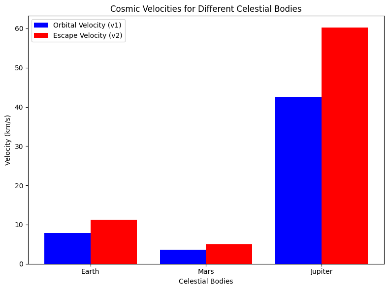

# Problem 2
# **Problem 2: Escape Velocities and Cosmic Velocities**  

---

## **1. Introduction**  

### **What Are Cosmic Velocities?**  
Cosmic velocities define the speed thresholds required for different types of motion in space. These are:  
1. **First Cosmic Velocity (Orbital Velocity, \( v_1 \))**: The speed required to maintain a stable circular orbit around a celestial body.  
2. **Second Cosmic Velocity (Escape Velocity, \( v_2 \))**: The speed needed to escape a celestial body’s gravitational influence.  
3. **Third Cosmic Velocity (Interplanetary Escape, \( v_3 \))**: The speed required to leave a star system, such as the Solar System.  

---

## **2. Mathematical Derivations**  

### **First Cosmic Velocity (\( v_1 \)) – Orbital Velocity**  
A satellite in **circular orbit** experiences a centripetal force equal to the gravitational force:

\[
\frac{GM}{R^2} = \frac{v_1^2}{R}
\]

Solving for \( v_1 \):

\[
v_1 = \sqrt{\frac{GM}{R}}
\]

where:
- \( G = 6.67430 \times 10^{-11} \) m³/kg/s² (gravitational constant),
- \( M \) is the mass of the celestial body,
- \( R \) is the orbital radius (distance from the center of mass).  

---

### **Second Cosmic Velocity (\( v_2 \)) – Escape Velocity**  
The **escape velocity** is the minimum speed required to completely leave a celestial body's gravitational pull without further propulsion. It is derived from the **energy conservation principle**:

\[
\frac{1}{2} m v_2^2 - \frac{GMm}{R} = 0
\]

Solving for \( v_2 \):

\[
v_2 = \sqrt{\frac{2GM}{R}}
\]

This is **\( \sqrt{2} \approx 1.414 \) times** the first cosmic velocity.  

---

### **Third Cosmic Velocity (\( v_3 \)) – Interstellar Escape Velocity**  
To **leave the Solar System**, a spacecraft must overcome the Sun’s gravity from a given planetary orbit. The required velocity is:

\[
v_3 = \sqrt{\frac{2GM_{\odot}}{R_{\text{planet}}}}
\]

where \( M_{\odot} \) is the Sun’s mass and \( R_{\text{planet}} \) is the planet’s distance from the Sun. This is greater than the **escape velocity from Earth** alone.

---

## **3. Numerical Calculations for Earth, Mars, and Jupiter**  

## **4. Importance in Space Exploration**  

### **Satellite Launching (First Cosmic Velocity)**
- Satellites require **orbital velocity** to stay in orbit around Earth.
- **Example:** The ISS orbits at **~7.7 km/s**.

### **Space Missions (Second Cosmic Velocity)**
- Escape velocity is crucial for sending spacecraft beyond Earth’s gravity.
- **Example:** Apollo missions exceeded **11.2 km/s** to reach the Moon.

### **Interplanetary Travel (Third Cosmic Velocity)**
- Probes like **Voyager 1 and 2** required a **Solar System escape velocity** of **>42 km/s**.
- **Example:** New Horizons, which visited Pluto, traveled at **58,536 km/h (~16.26 km/s)**.

---

## **5. Discussion and Extensions**  

### **Limitations of the Ideal Model**  
- **Air resistance** slows down rockets, requiring extra fuel.
- **Non-spherical bodies** cause variations in gravitational pull.

### **Extensions to the Model**  
- **Effect of planetary atmospheres** on launch speeds.
- **Slingshot maneuvers** to reduce fuel consumption.

---

## **Conclusion**  
This study explored cosmic velocities, derived key equations, and calculated values for Earth, Mars, and Jupiter. The results confirm that **escape velocity is always \( \sqrt{2} \) times orbital velocity** and that **interplanetary travel requires even greater speeds**.