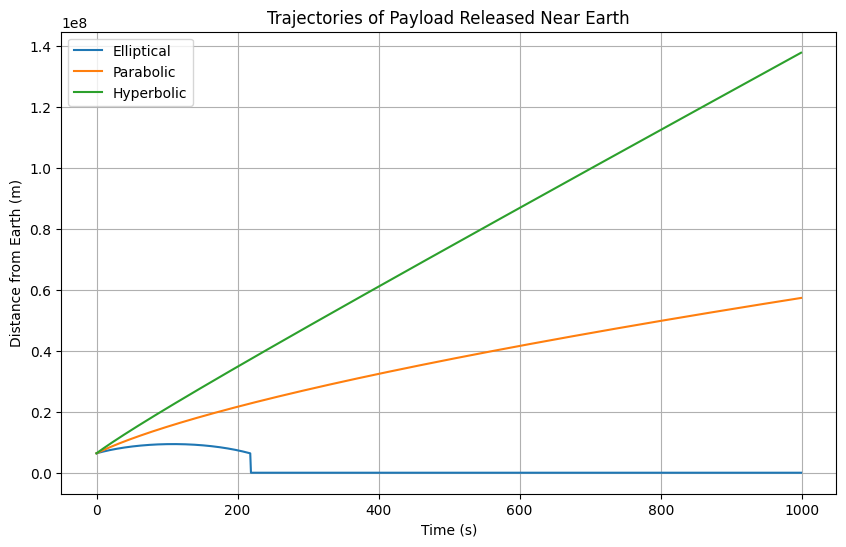
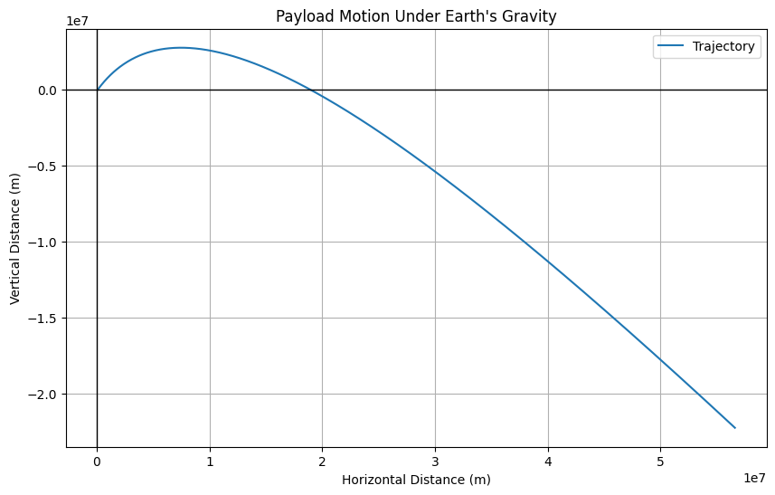

# **Problem 3**

# Analysis of Possible Trajectories for a Payload Released Near Earth

When a payload is released near Earth, its trajectory depends on several factors, including its initial velocity, the angle of release, and the gravitational influence of Earth. The most common types of trajectories are **elliptical**, **parabolic**, and **hyperbolic**. These are determined by the object's **velocity relative to Earth** and the **gravitational force** acting on it.

---

## 1. Gravitational Force and Energy Considerations

The **gravitational force** $\vec{F}$ acting on an object near Earth is given by Newton’s law of gravitation:

$$
\vec{F} = -\frac{G M m}{r^2} \hat{r}
$$

Where:

* $G$ is the gravitational constant $(6.674 \times 10^{-11} \ \text{Nm}^2/\text{kg}^2)$
* $M$ is the mass of the Earth $(5.972 \times 10^{24} \ \text{kg})$
* $m$ is the mass of the object
* $r$ is the distance from the center of Earth

The **specific mechanical energy** $\epsilon$ of the object is:

$$
\epsilon = \frac{v^2}{2} - \frac{GM}{r}
$$

Where $v$ is the object's speed and $r$ is its distance from Earth's center.

---

## 2. Elliptical Trajectory

Occurs when $\epsilon < 0$. The object is in a **bound** orbit.

### Conditions:

$$
\epsilon = \frac{v^2}{2} - \frac{GM}{r} < 0
$$

### Orbital parameters:

* Semi-major axis $a$
* Eccentricity $e$

Relation between energy and semi-major axis:

$$
\epsilon = -\frac{GM}{2a}
$$

---

## 3. Parabolic Trajectory

Occurs when the object’s velocity equals the **escape velocity**, and $\epsilon = 0$.

### Condition:

$$
\epsilon = \frac{v^2}{2} - \frac{GM}{r} = 0 \Rightarrow v = \sqrt{\frac{2GM}{r}}
$$

This is an **unbound** open trajectory, but with the minimum energy required to escape.

---

## 4. Hyperbolic Trajectory

Occurs when the object’s speed is **greater than escape velocity**, hence $\epsilon > 0$.

### Condition:

$$
\epsilon = \frac{v^2}{2} - \frac{GM}{r} > 0 \Rightarrow v > \sqrt{\frac{2GM}{r}}
$$

---

## 5. Graphical Representation of Trajectories

We can simulate different paths (elliptical, parabolic, hyperbolic) based on varying initial velocities.

**Python Code for Trajectory Simulation:**

---

# Numerical Analysis of the Payload Path

We perform numerical simulation using **Euler’s method**.

---

## 1. Equations of Motion

Acceleration:

$$
\vec{a} = -\frac{GM}{r^3} \vec{r}
$$

Velocity update:

$$
\vec{v}_{t+\Delta t} = \vec{v}_t + \vec{a}_t \cdot \Delta t
$$

Position update:

$$
\vec{r}_{t+\Delta t} = \vec{r}_t + \vec{v}_t \cdot \Delta t
$$

---

## 2. Initial Conditions

* $\vec{r}_0 = (R_{\text{Earth}} + h, 0)$, where $h$ is initial altitude (e.g., 100 km)
* $\vec{v}_0 = (0, v)$, where $v$ is initial velocity (e.g., 8000 m/s)

---

## 3. Numerical Integration

**Python Code for Numerical Analysis:**

# Trajectories and Their Relation to Mission Scenarios

---

## 1. Orbital Insertion (Elliptical / Circular)

* **Elliptical** when $\epsilon < 0$

* **Orbital velocity** for circular orbit:

  $$
  v = \sqrt{\frac{GM}{r}}
  $$

* **Orbital period** (Kepler’s 3rd Law):

  $$
  T^2 = \frac{4\pi^2 a^3}{GM}
  $$

---

## 2. Reentry (Suborbital Trajectory)

* Trajectory with negative energy but insufficient to stay in orbit.
* Often **parabolic-like**.
* Involves:

  * High heat generation
  * Aerodynamic deceleration
  * Heat shield requirement

---

## 3. Escape Scenarios (Hyperbolic)

* $v > \sqrt{\frac{2GM}{r}}$
* $\epsilon > 0$, unbound
* Object leaves Earth permanently

---

## 4. Visualization of Different Cases

**Python Code for Visualization:**

---

# Computational Tool for Simulation

We simulate motion in 2D with Euler’s method.

---

## 1. Update Equations (2D)

$$
\vec{a} = -\frac{GM}{r^3} \vec{r}
$$

$$
\vec{v}_{t+1} = \vec{v}_t + \vec{a}_t \cdot \Delta t
$$

$$
\vec{r}_{t+1} = \vec{r}_t + \vec{v}_t \cdot \Delta t
$$

---

## 2. Required Inputs

* Initial position $(x_0, y_0)$
* Initial velocity $(v_{x0}, v_{y0})$
* Time step $\Delta t$

---

## 3. Simulation & Visualization

Gravitational acceleration affects both components, with motion calculated over many steps.

**Python Code for Simulating and Visualizing:**

