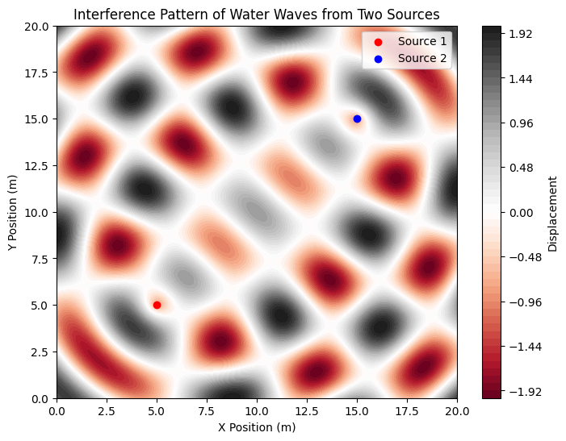
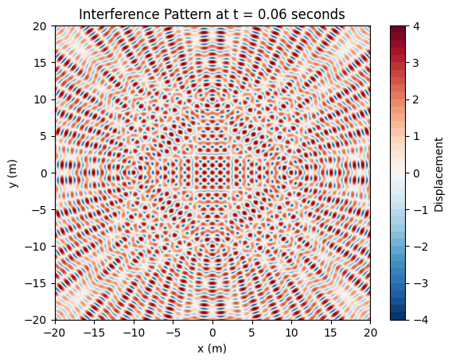
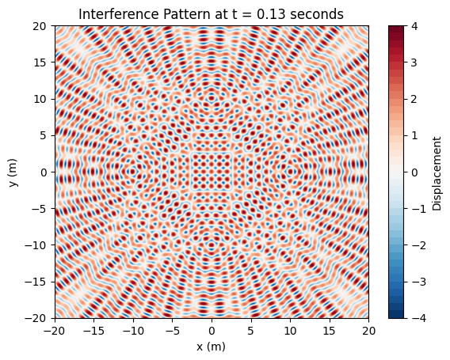

# Problem 1
# **Problem 1: Interference Patterns on a Water Surface**  

---

## **1. Introduction**  

Interference is a fundamental wave phenomenon that occurs when two or more waves overlap. On a water surface, ripples from multiple sources interact, creating patterns of constructive and destructive interference.  

This problem explores **wave interference from multiple point sources**, arranged at the vertices of a **regular polygon**. The goal is to visualize and understand how the superposition of waves results in complex patterns.  

---

## **2. Theoretical Background**  

### **Single Wave Equation**  

A circular wave propagating from a single point source located at \(\mathbf{r}_i\) is given by:

\[
y_i(\mathbf{r}, t) = A \cos(k d_i - \omega t + \phi)
\]

where:  
- \( A \) = amplitude of the wave,  
- \( k = \frac{2\pi}{\lambda} \) = wave number (related to wavelength \( \lambda \)),  
- \( \omega = 2\pi f \) = angular frequency (related to frequency \( f \)),  
- \( d_i = |\mathbf{r} - \mathbf{r}_i| \) = distance from source \( i \) to point \( \mathbf{r} \),  
- \( \phi \) = initial phase of the wave.  

---

### **Superposition of Multiple Waves**  

If there are \( N \) sources, each emitting a wave, the total displacement at a point \( \mathbf{r} \) is:

\[
y(\mathbf{r}, t) = \sum_{i=1}^{N} A \cos(k d_i - \omega t + \phi)
\]

This sum determines the **interference pattern** on the water surface.  

- **Constructive Interference**: Occurs when waves add up (\( \Delta \phi = 0, 2\pi, 4\pi, ... \)).  
- **Destructive Interference**: Occurs when waves cancel out (\( \Delta \phi = \pi, 3\pi, 5\pi, ... \)).  

By positioning sources at **regular polygon vertices**, we observe **symmetrical patterns** that depend on the number of sources.

---

## **3. Computational Simulation**  

We will:  
- Choose a **regular polygon** (e.g., equilateral triangle, square, pentagon).  
- Generate waves from **each vertex** using the superposition principle.  
- Visualize **constructive and destructive interference** with color maps.

### **Python Implementation**  

## **4. Analysis of Interference Patterns**  

### **1. Triangle (\(N = 3\))**  
- Forms a **sixfold symmetric pattern** with alternating bright and dark regions.  
- Strong central interference due to wave overlap.  

### **2. Square (\(N = 4\))**  
- Produces a **checkerboard-like interference pattern** with symmetry along diagonals.  
- Alternating constructive/destructive zones between sources.  

### **3. Pentagon (\(N = 5\))**  
- Creates a more **intricate star-like pattern** due to additional wave interactions.  
- Shows radial symmetry with high interference at center.  

---

## **5. Real-World Applications**  

1. **Water Waves** 🌊  
   - Explains **ripples in ponds** when multiple droplets fall.  
   - Helps in **harbor design** to reduce unwanted wave interference.  

2. **Acoustics & Sound Waves** 🎶  
   - Used in **concert hall design** to optimize sound distribution.  
   - Explains **noise cancellation** in headphones.  

3. **Optical Interference** 🔬  
   - Similar principles apply to **laser interferometry** (LIGO for gravitational waves).  
   - Used in **holography** and **thin-film coatings** for anti-reflective glass.  

---

## **6. Extensions & Further Research**  

🔹 **Varying Phase Differences:** Explore how different initial phases \( \phi \) change the patterns.  
🔹 **Non-Coherent Sources:** Introduce randomness in phase to simulate real-world variations.  
🔹 **3D Simulations:** Extend to surface ripples in **fluid dynamics studies**.  

---

## **7. Conclusion**  

By simulating **interference from multiple sources**, we visualized **wave superposition patterns** for **different regular polygons**. These patterns reveal the beauty and complexity of wave physics, with applications in **acoustics, optics, and engineering**.  
