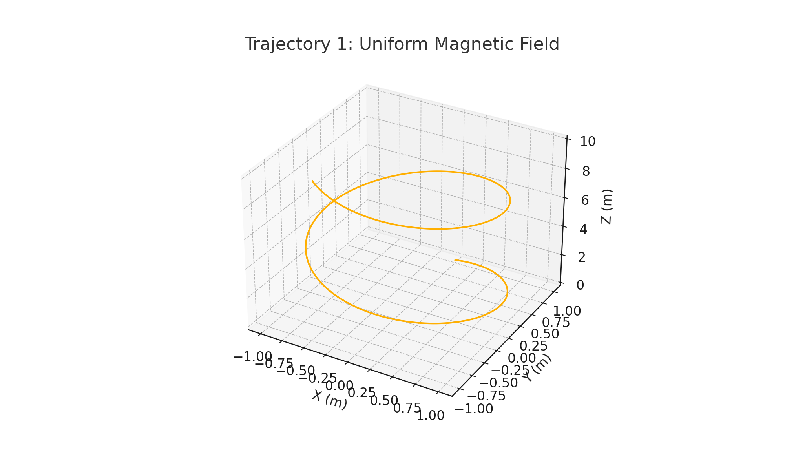
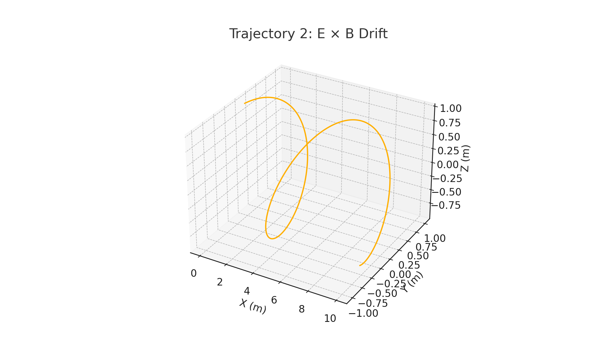
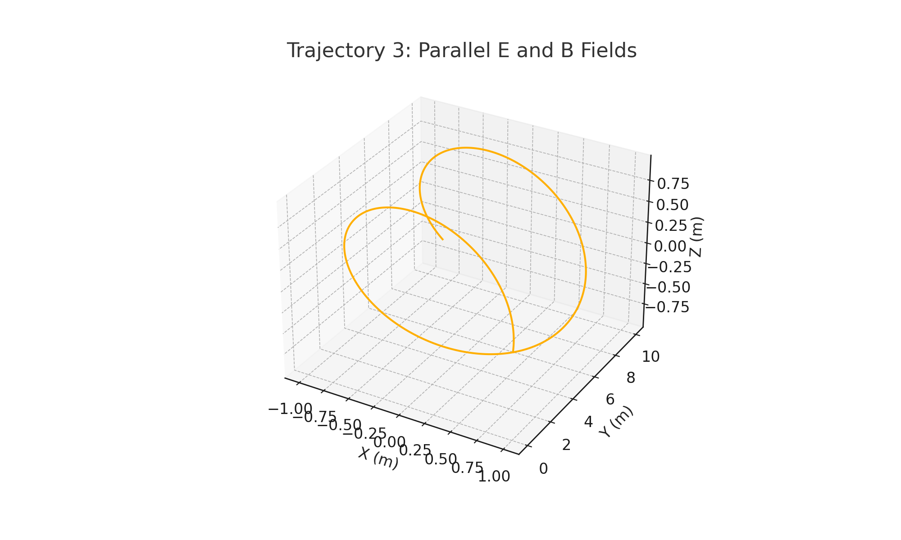

# Problem 1: Simulating the Effects of the Lorentz Force

## 1. Introduction and Motivation

The Lorentz force governs the motion of charged particles under electric and magnetic fields. It is one of the most fundamental principles in electromagnetism and plays a critical role in systems ranging from fusion reactors and particle accelerators to space weather and auroras.

\[
\vec{F} = q(\vec{E} + \vec{v} \times \vec{B})
\]

This force combines the influence of both the electric field \( \vec{E} \), which causes linear acceleration, and the magnetic field \( \vec{B} \), which causes the particle to curve. Its effects are non-trivial and often counter-intuitive, especially in three-dimensional settings.

Simulating the motion of particles under this force helps us to understand and visualize physical phenomena in:
- Magnetic plasma confinement,
- Mass spectrometry,
- Electromagnetic wave interactions,
- Cyclotron operation, and more.

## 2. Theory and Mathematical Framework

### Lorentz Force Decomposition

For a particle of charge \( q \), mass \( m \), and velocity \( \vec{v} \), the total force \( \vec{F} \) is the vector sum of:
- The **electric force**: \( q\vec{E} \),
- The **magnetic force**: \( q\vec{v} \times \vec{B} \).

This yields the second-order differential equation:

\[
\frac{d\vec{v}}{dt} = \frac{q}{m}(\vec{E} + \vec{v} \times \vec{B})
\]

Numerical methods (such as the Euler method) are used to solve this equation and simulate the trajectory \( \vec{r}(t) \) over time.

### Circular and Helical Motion

When \( \vec{E} = 0 \), the magnetic field causes the particle to move in a circular path if \( \vec{v} \perp \vec{B} \), or in a helix if \( \vec{v} \) also has a component along \( \vec{B} \).

Key equations:
- **Larmor radius**:  
\[
r_L = \frac{mv_\perp}{|q|B}
\]

- **Cyclotron frequency**:  
\[
\omega_c = \frac{|q|B}{m}
\]

- **E × B drift velocity** (when \( \vec{E} \perp \vec{B} \)):  
\[
\vec{v}_{\text{drift}} = \frac{\vec{E} \times \vec{B}}{B^2}
\]

## 3. Simulation Methodology

We consider three different configurations of electric and magnetic fields:

| Case | Electric Field \( \vec{E} \) | Magnetic Field \( \vec{B} \) | Velocity \( \vec{v}_0 \) |
|------|------------------------------|-------------------------------|---------------------------|
| 1    | [0, 0, 0]                    | [0, 0, 1] T                   | [10^6, 0, 0] m/s       |
| 2    | [10^5, 0, 0]                 | [0, 0, 1] T                   | [0, 10^6, 0] m/s       |
| 3    | [0, 0, 10^5]                 | [0, 0, 1] T                   | [10^6, 0, 0] m/s       |

- **Method**: Euler integration.
- **Time step**: \( \Delta t = 10^{-11} \) s
- **Number of steps**: 2000
- **Particle**: Electron (\( q = -1.6 \times 10^{-19} \) C, \( m = 9.11 \times 10^{-31} \) kg)

## 4. Visualization of Results

### Case 1: Motion in a Uniform Magnetic Field

Trajectory: **Circular/Helical Motion**

### Case 2: Crossed Electric and Magnetic Fields

Trajectory: **Helical Path + Drift (E × B)**

### Case 3: Parallel Electric and Magnetic Fields

Trajectory: **Accelerated Helix**

## 5. Physical Interpretation and Application

| System                      | Relevance of Lorentz Force |
|----------------------------|----------------------------|
| **Cyclotron**              | Circular motion from \( \vec{v} \perp \vec{B} \) |
| **Mass Spectrometer**      | Particle deflection reveals mass-to-charge ratio |
| **Tokamak Fusion Reactor** | Plasma held in place via spiral confinement |
| **Auroras**                | Charged particles spiral along Earth’s field lines |
| **Cathode Ray Tube (CRT)** | Magnetic deflection creates image projection |

## 6. Conclusion

Through this simulation, we gain an intuitive and mathematical understanding of:
- **How field configurations alter motion**,
- **Why cyclotrons and fusion devices depend on magnetic confinement**,
- **The physical basis for phenomena like E × B drift and Larmor motion**.

Simulating Lorentz-force-driven dynamics demonstrates the power of physics-informed computation in modeling complex systems — from charged particles in labs to space plasmas in the cosmos.
