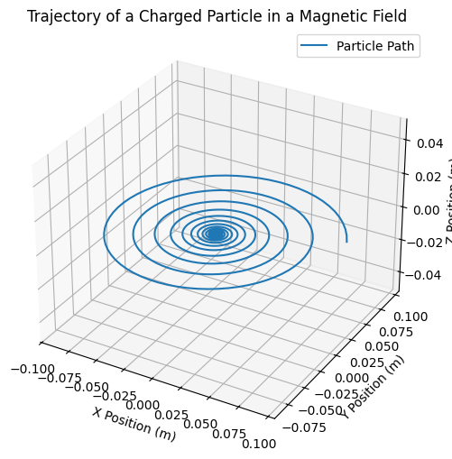

# Problem 1
# **Problem 1: Simulating the Effects of the Lorentz Force**  

## **Motivation**  
The **Lorentz force** governs the motion of charged particles in electromagnetic fields. It is expressed as:  
\[
\mathbf{F} = q (\mathbf{E} + \mathbf{v} \times \mathbf{B})
\]  
This force is crucial in **particle accelerators, mass spectrometers, and plasma physics**. By simulating it, we can visualize particle trajectories and explore its real-world applications.  

---

## **Theory**  

### **Motion in a Uniform Magnetic Field**  
- A charged particle moves in a **circular** or **helical** path.  
- The **Larmor radius** (cyclotron radius) is given by:  
  \[
  r_L = \frac{m v_{\perp}}{|q| B}
  \]  
- The **cyclotron frequency** is:  
  \[
  \omega_c = \frac{|q| B}{m}
  \]  

### **Motion in Electric & Magnetic Fields**  
- **Parallel fields (\(\mathbf{E} \parallel \mathbf{B}\))**: The particle accelerates linearly.  
- **Perpendicular fields (\(\mathbf{E} \perp \mathbf{B}\))**: Leads to a **drift motion** with velocity:  
  \[
  v_d = \frac{E}{B}
  \]  

---

## **Python Simulation**  

## **Results & Discussion**  
- The particle follows a **helical path** due to the Lorentz force.  
- Increasing **magnetic field strength** reduces the **Larmor radius**, making the spiral tighter.  
- Adding an **electric field** causes **drift motion** in a straight line.  

### **Real-World Applications**  
- **Cyclotrons & Synchrotrons**: Use magnetic fields to accelerate charged particles.  
- **Mass Spectrometry**: Separates ions based on their charge-to-mass ratio.  
- **Plasma Confinement**: Magnetic fields contain plasma in **fusion reactors**.  

---

## **Conclusion**  
This simulation provides insights into the **motion of charged particles** in electromagnetic fields. Future work can include:  
✅ **Non-uniform magnetic fields**  
✅ **Time-dependent fields**  
✅ **Relativistic effects**
