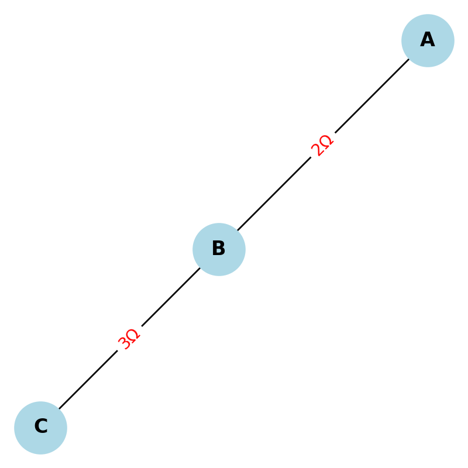
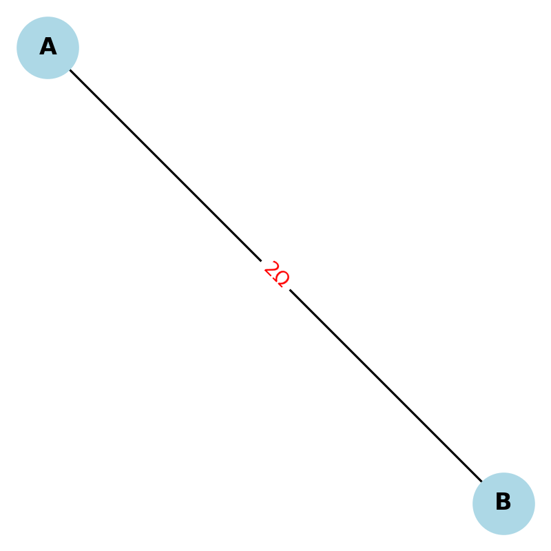

# Problem 1: Equivalent Resistance Using Graph Theory

---

## Motivation

Calculating equivalent resistance is a core topic in electrical engineering and physics. It allows us to simplify circuit analysis and understand how current flows through different configurations. Traditional approaches rely heavily on applying series and parallel combination rules, which quickly become inefficient or error-prone as circuit complexity increases.

Graph theory introduces a mathematical framework for representing and solving these problems systematically. By modeling a circuit as a **weighted undirected graph**, where:
- **Nodes** represent junctions,
- **Edges** represent resistors (weighted by resistance values),

we can leverage well-known graph traversal and reduction techniques to simplify the circuit step-by-step.

This approach is scalable, programmable, and aligns well with modern circuit simulation tools.

---

## Theoretical Framework

### Circuit as a Graph

Each resistor is an edge between two nodes:
- A series connection forms a **path** in the graph,
- A parallel connection forms a **cycle**.

We aim to reduce the graph to a single edge between the source and ground (or any two terminal nodes), representing the **total equivalent resistance**.

---

## Option 1: Simplified Algorithm Description

### Series and Parallel Reduction Logic

#### 1. Detect Series Connections:
- Nodes with **degree 2**, connecting only two resistors, are candidates.
- Combine resistors:

\[
R_{\text{eq}} = R_1 + R_2
\]

#### 2. Detect Parallel Connections:
- **Multiple edges** between the same two nodes (parallel resistors).
- Combine using reciprocal rule:

\[
\frac{1}{R_{\text{eq}}} = \frac{1}{R_1} + \frac{1}{R_2} + \cdots
\]

---

## Pseudocode for Reduction

```
function compute_equivalent_resistance(graph, node_start, node_end):
    while graph has more than 1 edge between start and end:
        for each node in graph:
            if degree(node) == 2:
                combine_series(node)
        for each pair of nodes (u, v):
            if multiple_edges(u, v):
                combine_parallel(u, v)
    return weight of final edge between node_start and node_end
```

---

## Option 2: Full Python Implementation

We implement the algorithm using Python and the `networkx` library for graph manipulation. The function reduces the graph iteratively by identifying series and parallel connections until only the equivalent resistance remains.

> **Note**: This section is illustrated with code screenshots or output below.

---

## Example 1: Simple Series

```
A --[2Ω]-- B --[3Ω]-- C
```

**Expected Result**:

\[
R_{\text{eq}} = 2 + 3 = 5\, \Omega
\]

**Graph Output**:  


---

## Example 2: Simple Parallel

```
A --[2Ω]-- B  
 \       
  \--[2Ω]--/
```

**Expected Result**:

\[
\frac{1}{R_{\text{eq}}} = \frac{1}{2} + \frac{1}{2} = 1 \Rightarrow R_{\text{eq}} = 1\, \Omega
\]

**Graph Output**:  


---

## Example 3: Nested Configuration

```
      [2Ω]
     /    \
A --        -- B
     \[3Ω]/
```

**Expected Result** (Parallel):

\[
\frac{1}{R} = \frac{1}{2} + \frac{1}{3} = \frac{5}{6} \Rightarrow R = 1.2\, \Omega
\]

**Graph Output**:  


---

## Complexity and Optimizations

- The algorithm reduces the graph iteratively by targeting nodes and edges with clear patterns.
- **Time complexity** depends on:
  - Number of nodes (\( V \))
  - Number of edges (\( E \))

**Best Case**: All series and parallel chains detected in one pass.  
**Worst Case**: Nested and interconnected structures may require multiple passes.

---

## Conclusion

Graph theory provides a robust method for automating the computation of equivalent resistance. It scales efficiently to complex circuits and allows formal reasoning through the lens of connectivity and structure. Through detection and reduction of series and parallel patterns, we can simulate real-world circuits and contribute to design automation tools and optimization algorithms.
