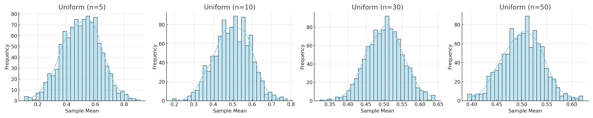
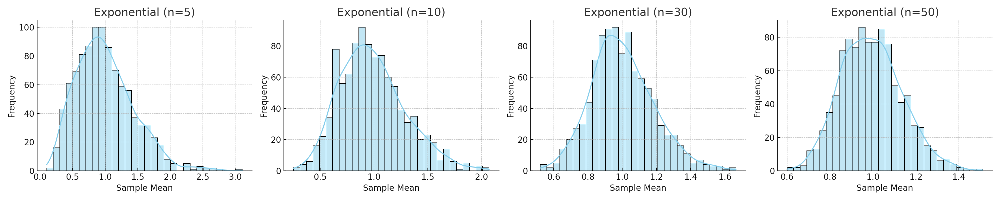

# Problem 1: Exploring the Central Limit Theorem through Simulations

---

## Motivation

The **Central Limit Theorem (CLT)** is one of the most powerful and widely used results in probability theory. It states:

> "Regardless of the shape of the population distribution, the distribution of the sample mean will approach a normal distribution as the sample size increases, provided the samples are independent and identically distributed."

Simulations allow us to observe this theoretical principle in action. We will analyze how different initial distributions (e.g., Uniform, Exponential, Binomial) behave when repeatedly sampled and their sample means analyzed.

---

## 1. Simulating Sampling Distributions

We select three population distributions:

| Distribution Type | Parameters |
|--------------------|------------|
| Uniform            | low = 0, high = 1 |
| Exponential        | λ = 1      |
| Binomial           | n = 10, p = 0.5 |

For each distribution:
- A **population** of 100,000 data points is generated.
- From this population, we draw random samples of sizes: **5, 10, 30, 50**.
- For each sample size, **1000 samples** are drawn, and their **means** are recorded.

---

## 2. Sampling and Visualization

The histograms below illustrate how the **distribution of sample means** changes as the sample size increases.

### Uniform Distribution

- **Population shape**: Flat.
- **CLT effect**: Gradual convergence to normal shape.

---

### Exponential Distribution

- **Population shape**: Right-skewed.
- **CLT effect**: Fast convergence due to infinite support.

---

### Binomial Distribution

- **Population shape**: Discrete, symmetric at p = 0.5.
- **CLT effect**: Becomes smoother with larger samples.

---

## 3. Parameter Exploration

The rate at which the sample means converge to normality depends on:

- **Original distribution shape**:
  - Strongly skewed distributions (like exponential) take longer.
  - Symmetric distributions (like binomial with p=0.5) converge faster.

- **Sample size (n)**:
  - As \( n 
ightarrow \infty \), the variance of the sample mean becomes:
  \[
  	ext{Var}(ar{X}) = \frac{\sigma^2}{n}
  \]

- **Population variance (σ²)**:
  - Higher population variance leads to wider sampling distributions.

---

## 4. Practical Applications

The CLT has broad applications:

| Domain            | Application |
|------------------|-------------|
| **Manufacturing** | Quality control and defect rate estimation |
| **Finance**       | Risk modeling and portfolio prediction |
| **Healthcare**    | Estimating treatment effects in clinical trials |
| **Survey Research** | Polling and inference about populations |

---

## 5. Conclusion

The Central Limit Theorem allows us to apply the powerful framework of normal distributions to problems where the underlying distribution is unknown or non-normal. Through simulation, we visually confirm:

- The **universal behavior** of the sampling mean distribution.
- The **reduction in spread** with increasing sample size.
- The **approach to Gaussian symmetry** as predicted by theory.

Understanding CLT bridges the gap between probability theory and statistical inference, empowering data-driven decision-making across all fields of science.

---

