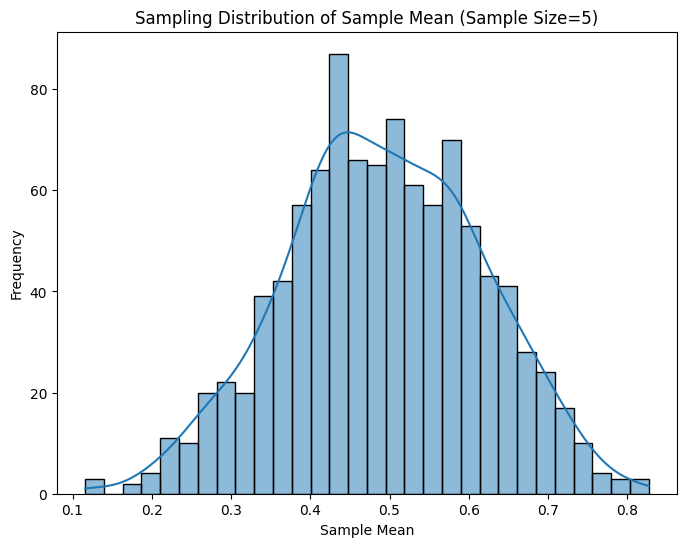

# Problem 1
# **Problem 1: Exploring the Central Limit Theorem through Simulations**  

## **Motivation**  
The **Central Limit Theorem (CLT)** states that, regardless of the original population distribution, the **sampling distribution of the sample mean** approaches a **normal distribution** as the sample size increases. This principle is fundamental in **statistics, quality control, and financial modeling**.  

---

## **Theory**  

1. **Population Distributions**: We test CLT using different distributions:  
   - **Uniform Distribution** (equal probability for all values)  
   - **Exponential Distribution** (skewed, represents waiting times)  
   - **Binomial Distribution** (discrete probability of successes in trials)  

2. **Sampling Process**:  
   - Draw random samples of different sizes (\(n=5, 10, 30, 50\)).  
   - Compute sample means.  
   - Repeat the process many times to form a **sampling distribution**.  

3. **Expected Outcome**:  
   - As \(n\) increases, the **sampling distribution of the mean** should approximate a **normal distribution**, even if the original distribution was not normal.  

---

## **Python Simulation**  

## **Results & Discussion**  
- **Small sample sizes** (\(n=5,10\)): The sampling distribution still reflects some characteristics of the original population.  
- **Larger sample sizes** (\(n=30,50\)): The sampling distributions become **approximately normal**, regardless of the original population shape.  
- **Higher variance in the original population** slows down convergence to normality.  

### **Real-World Applications**  
✅ **Quality Control**: Used in manufacturing to assess product consistency.  
✅ **Finance & Risk Management**: Predicts stock returns and economic trends.  
✅ **Medical Research**: Enables population-based inferences from sample studies.  

---

## **Conclusion**  
This simulation demonstrates **CLT in action**, showing how sample size affects the normality of the sample mean distribution. Future work could explore:  
✅ **Different population distributions** (e.g., heavy-tailed)  
✅ **Impact of sample variance** on convergence  
✅ **Confidence intervals & hypothesis testing** using CLT
