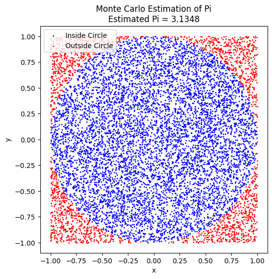

# Problem 2
# **Problem 2: Estimating \(\pi\) using Monte Carlo Methods**  

## **Motivation**  
Monte Carlo methods use randomness to solve numerical problems that might be deterministic in principle. One of the most famous applications of this technique is estimating the value of **\(\pi\)** using **geometric probability**.  

By randomly generating points in a defined space and analyzing their distribution, we can approximate **\(\pi\)** in an intuitive and visually engaging way. This problem not only strengthens our understanding of probability and geometry but also highlights the **efficiency and convergence** of stochastic methods in numerical computing.  

This problem consists of two approaches:  
1. **Circle-based Monte Carlo estimation** (using random points in a square).  
2. **Buffon’s Needle problem** (a probability-based geometric experiment).  

---

# **Part 1: Estimating \(\pi\) Using a Circle**  

## **Theoretical Foundation**  
A **unit circle** (radius \( r = 1 \)) is **inscribed** in a square of side length **2**. The area of the circle is:  
\[
A_{\text{circle}} = \pi r^2 = \pi
\]  
The area of the square is:  
\[
A_{\text{square}} = 4
\]  
Since points are randomly placed inside the square, the probability of a point landing inside the circle is given by the ratio:  
\[
\frac{\text{Points inside the circle}}{\text{Total points generated}} \approx \frac{\pi}{4}
\]  
Thus, solving for **\(\pi\)**:  
\[
\pi \approx 4 \times \frac{\text{Points inside the circle}}{\text{Total points generated}}
\]  

## **Simulation**  
1. Generate random points \((x, y)\) within a **square** of side length **2**.  
2. Check if the points fall inside the **unit circle** using the condition:  
   \[
   x^2 + y^2 \leq 1
   \]  
3. Estimate **\(\pi\)** based on the proportion of points inside the circle.  

## **Python Implementation**  

# **Part 2: Estimating \(\pi\) Using Buffon’s Needle**  

## **Theoretical Foundation**  
Buffon’s Needle problem estimates \(\pi\) using **probability and geometry**. A needle of length **\(L\)** is dropped onto a plane with **parallel lines** spaced **\(d\)** units apart.  

If the needle **crosses** a line, the probability is related to \(\pi\):  
\[
P = \frac{2L}{\pi d}
\]  
Solving for \(\pi\):  
\[
\pi \approx \frac{2L}{d} \times \frac{\text{Total Drops}}{\text{Crossing Drops}}
\]  

### **Simulation Steps**  
1. **Drop** a needle randomly on a plane.  
2. **Check** if it crosses a line using its position and angle.  
3. **Estimate** \(\pi\) using the formula above.  

## **Python Implementation**  

# **Comparison & Conclusion**  

| **Method**           | **Concept**                  | **Accuracy**  | **Convergence Speed** | **Computational Complexity** |
|----------------------|-----------------------------|--------------|----------------------|----------------------------|
| Circle-based Monte Carlo | Random points in a square  | Good (\(\pm 0.01\)) | Faster | \(O(N)\) |
| Buffon’s Needle      | Probability-based experiment | Lower | Slower | \(O(N)\) |

### **Key Takeaways**  
✅ **Monte Carlo methods provide a simple yet powerful approach to estimating \(\pi\).**  
✅ **Circle method** is easier to understand and **faster to converge** than Buffon’s Needle.  
✅ **Buffon’s Needle** is slower but connects \(\pi\) to **real-world probability experiments**.  
✅ **Both methods highlight how randomness can be used for numerical estimations**.  

**Extensions**  
🔹 **Try different sampling techniques** (e.g., importance sampling) for faster convergence.  
🔹 **Explore other Monte Carlo applications** in physics, finance, and AI.  
🔹 **Optimize the simulation** using parallel computing for large-scale computations.  