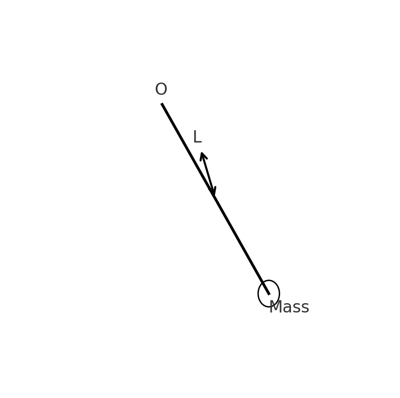
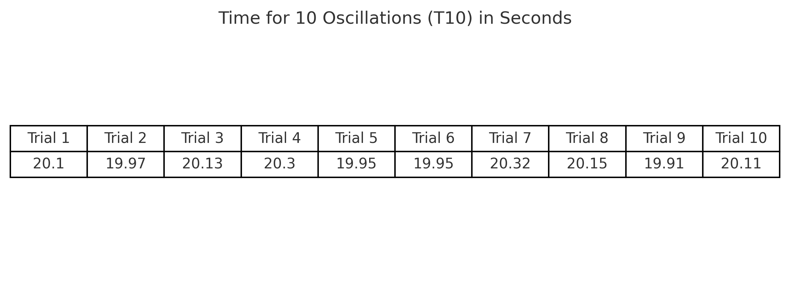
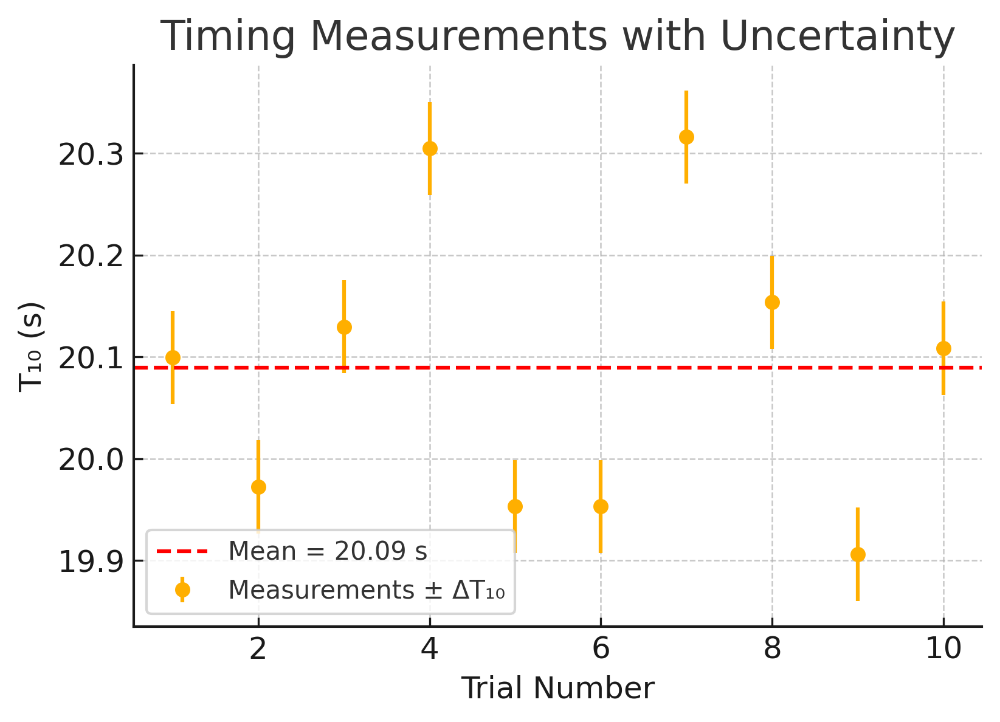

---

# Problem 1

## Measuring Earth's Gravitational Acceleration with a Pendulum

---

### 📌 Motivation

The acceleration $g$ due to gravity is a fundamental constant that influences a wide range of physical phenomena. Measuring $g$ accurately is crucial for understanding gravitational interactions, designing structures, and conducting experiments in various fields. One classic method for determining $g$ is through the oscillations of a simple pendulum, where the period of oscillation depends on the local gravitational field.

---

### 🧪 Task

Measure the acceleration $g$ due to gravity using a pendulum and in detail analyze the uncertainties in the measurements.

This exercise emphasizes rigorous measurement practices, uncertainty analysis, and their role in experimental physics.

---

### 🧰 Procedure

#### 1. Materials

* A string (1 or 1.5 meters long).
* A small weight (e.g., bag of coins, bag of sugar, key chain) mounted on the string.
* Stopwatch (or smartphone timer).
* Ruler or measuring tape.

#### 2. Setup

* Attach the weight to the string and fix the other end to a sturdy support.
* Measure the length of the pendulum, $L$, from the suspension point to the center of the weight using a ruler or measuring tape.
* Record the resolution of the measuring tool and calculate the uncertainty as:

$$
\Delta L = \frac{\text{Ruler Resolution}}{2}
$$

#### 3. Data Collection

* Displace the pendulum slightly ( < 15° ) and release it.
* Measure the time for 10 full oscillations ($T_{10}$) and repeat this process 10 times. Record all 10 measurements.
* Calculate the mean time for 10 oscillations ($\overline{T}_{10}$) and the standard deviation ($\sigma_T$).
* Determine the uncertainty in the mean time as:

$$
\Delta T_{10} = \frac{\sigma_T}{\sqrt{n}} \quad \text{where } n = 10
$$

---

### 🧮 Calculations

#### 1. Calculate the period

$$
T = \frac{\overline{T}_{10}}{10}, \quad \Delta T = \frac{\Delta T_{10}}{10}
$$

#### 2. Determine $g$

$$
g = \frac{4\pi^2 L}{T^2}
$$

#### 3. Propagate uncertainties

$$
\Delta g = g \cdot \sqrt{\left( \frac{\Delta L}{L} \right)^2 + \left( 2 \cdot \frac{\Delta T}{T} \right)^2}
$$

---

### 📊 Data and Visualizations

#### Time Measurements for 10 Oscillations

#### Uncertainty Plot

---

### 🔍 Analysis

#### 1. Compare your measured $g$ with the standard value:

$$
g_{\text{standard}} = 9.81\, \text{m/s}^2
$$

#### 2. Discuss:

* The effect of measurement resolution on $\Delta L$.
* Variability in timing and its impact on $\Delta T$.
* Any assumptions or experimental limitations.

---

### 📦 Deliverables

1. Tabulated data in markdown:

   * $L, \Delta L, T_{10}$ measurements, $\overline{T}_{10}, \sigma_T, \Delta T$
   * Calculated $g$ and $\Delta g$

2. The discussion on sources of uncertainty and their impact on the results.

---
