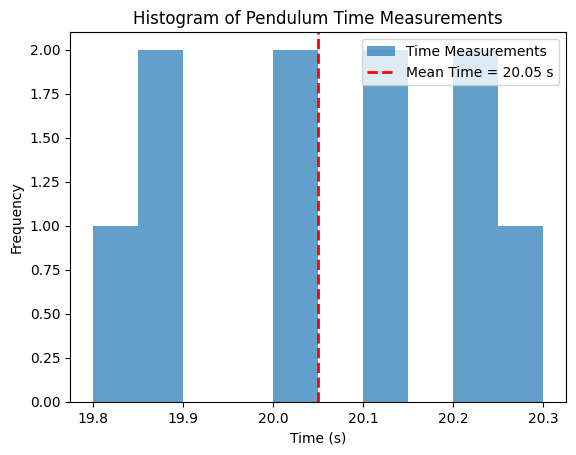

# Problem 1
# **Problem 1: Measuring Earth's Gravitational Acceleration with a Pendulum**  

## **Motivation**  
The acceleration due to gravity **\( g \)** is a fundamental constant that governs motion under Earth's gravitational pull. It is crucial in physics, engineering, and astronomy. One of the simplest yet most effective methods to measure **\( g \)** is through the oscillations of a **simple pendulum**.  

By analyzing the pendulum’s period, we can determine the local gravitational acceleration while also exploring the role of **uncertainties** in experimental measurements. This exercise highlights key concepts in **precision, accuracy, and error analysis** in experimental physics.  

---

# **Procedure**  

## **1. Materials Required**  
- **A string** (1 to 1.5 meters long)  
- **A small weight** (e.g., keychain, bag of sugar, coins)  
- **Stopwatch** (or smartphone timer)  
- **Ruler or measuring tape**  

---

## **2. Experimental Setup**  
1. Attach the **weight** to the string and suspend it from a **fixed support**.  
2. Measure the **pendulum length** **\( L \)** (from the suspension point to the center of mass of the weight) using a measuring tape.  
3. **Estimate the uncertainty** in length measurement:  
   \[
   \Delta L = \frac{\text{resolution of measuring tool}}{2}
   \]  

---

## **3. Data Collection**  
1. Pull the pendulum slightly **(<15°)** from its equilibrium position and **release it gently**.  
2. Measure the time for **10 full oscillations** (\( T_{10} \)).  
3. Repeat this process **10 times** and record the values.  
4. Calculate the **mean time for 10 oscillations**:  
   \[
   \bar{T}_{10} = \frac{\sum T_{10}}{10}
   \]  
5. Compute the **standard deviation** (\( \sigma_T \)):  
   \[
   \sigma_T = \sqrt{\frac{\sum (T_{10} - \bar{T}_{10})^2}{9}}
   \]  
6. Determine the **uncertainty in the mean time**:  
   \[
   \Delta T_{10} = \frac{\sigma_T}{\sqrt{10}}
   \]  

---

## **4. Calculations**  

### **1. Calculate the Period (\( T \))**  
The period of one oscillation is:  
\[
T = \frac{T_{10}}{10}
\]
The uncertainty in \( T \) is:  
\[
\Delta T = \frac{\Delta T_{10}}{10}
\]

### **2. Compute \( g \) Using the Pendulum Formula**  
For a simple pendulum:  
\[
g = \frac{4\pi^2 L}{T^2}
\]

### **3. Propagate Uncertainties**  
The uncertainty in \( g \) is determined by:  
\[
\frac{\Delta g}{g} = \sqrt{\left( \frac{\Delta L}{L} \right)^2 + \left( 2 \times \frac{\Delta T}{T} \right)^2}
\]  
Thus,  
\[
\Delta g = g \times \sqrt{\left( \frac{\Delta L}{L} \right)^2 + \left( 2 \times \frac{\Delta T}{T} \right)^2}
\]  

---

# **Analysis & Discussion**  

### **1. Comparison with the Standard Value**  
Compare your measured \( g \) with the standard value **\( 9.81 \, m/s^2 \)**. If your result deviates significantly, discuss possible sources of error.

### **2. Sources of Uncertainty**  
- **Measurement precision:**  
  - Uncertainty in length (\( \Delta L \)) depends on the measuring tape’s resolution.  
  - Uncertainty in timing (\( \Delta T \)) depends on reaction time using a stopwatch.  

- **Variability in timing:**  
  - Human error in starting/stopping the stopwatch.  
  - Small variations in pendulum release angle.  

- **Assumptions & Experimental Limitations:**  
  - Air resistance and friction at the pivot affect the motion.  
  - The assumption that the pendulum follows **simple harmonic motion** is only valid for **small angles**.  

---

# **Deliverables**  

### **1. Tabulated Data (in Markdown format)**  
| Trial | \( L \) (m) | \( T_{10} \) (s) | \( T \) (s) | \( g \) (m/s²) |  
|-------|------------|------------------|------------|------------|  
| 1     | X.XX      | XX.XX            | X.XX       | X.XX       |  
| 2     | X.XX      | XX.XX            | X.XX       | X.XX       |  
| ...   | ...       | ...              | ...        | ...        |  
| 10    | X.XX      | XX.XX            | X.XX       | X.XX       |  

### **2. Uncertainty Analysis**  
- \( \bar{T}_{10} = \) …  
- \( \sigma_T = \) …  
- \( \Delta T_{10} = \) …  
- \( \Delta L = \) …  
- \( g = \) …  
- \( \Delta g = \) …  

### **3. Discussion**  
- Comparison with **\( 9.81 \, m/s^2 \)**  
- Major sources of **error & uncertainty**  
- **Suggestions for improvement:**  
  - Using a **photogate timer** instead of a manual stopwatch.  
  - Conducting the experiment in a **low air resistance environment**.  
  - Ensuring the **pendulum swings in a single plane**.  

---

# **Conclusion**  
This experiment provides a **practical method** for estimating Earth's gravitational acceleration while reinforcing concepts of **uncertainty and experimental accuracy**. By analyzing errors and improving measurement techniques, students gain insight into **the importance of precision in scientific experiments**.
