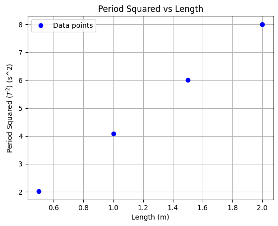

# Problem 1

## Answer: Measure the Acceleration $g$ Due to Gravity Using a Pendulum

### Motivation:

The goal of this experiment is to accurately measure the acceleration $g$ due to gravity by analyzing the oscillations of a simple pendulum. Through precise measurements and uncertainty analysis, we aim to understand how experimental errors affect the result.

### Procedure:

1. **Materials:**

   * A string (1 or 1.5 meters long).
   * A small weight (e.g., bag of coins, bag of sugar, key chain).
   * Stopwatch or smartphone timer.
   * Ruler or measuring tape.

2. **Setup:**

   * The weight is attached to the string, and the other end is fixed to a sturdy support.
   * Measure the length of the pendulum, $L$, from the suspension point to the center of the weight using the ruler or measuring tape. The uncertainty in the length measurement is determined as half the resolution of the ruler:

     $$
     \Delta L = \frac{\text{(Ruler Resolution)}}{2}
     $$

3. **Data Collection:**

   * Displace the pendulum slightly (less than $15^\circ$) and release it.
   * Measure the time for 10 full oscillations ($T_{10}$) and repeat this process 10 times. Record all 10 measurements.
   * Calculate the mean time for 10 oscillations ($\overline{T}_{10}$) and the standard deviation ($\sigma_T$).
   * The uncertainty in the mean time is determined as:

     $$
     \Delta T_{10} = \frac{\sigma_T}{\sqrt{n}}
     $$

     where $n = 10$.

### Calculations:

1. **Calculate the period:**

   $$
   T = \frac{\overline{T}_{10}}{10}
   $$

2. **Determine $g$:**

   $$
   g = \frac{4\pi^2 L}{T^2}
   $$

3. **Propagate uncertainties:**

   $$
   \Delta g = g \sqrt{\left(\frac{\Delta L}{L}\right)^2 + \left(2 \frac{\Delta T}{T}\right)^2}
   $$

### Graphs:

#### 1. Graph of Period $T$ vs Length $L$:

The period $T$ of a pendulum is related to its length $L$ by the following formula:

$$
T = 2\pi \sqrt{\frac{L}{g}}
$$

You can create a graph of $T^2$ vs $L$ and expect a linear relationship. The slope of this line will help you calculate the acceleration due to gravity $g$.

