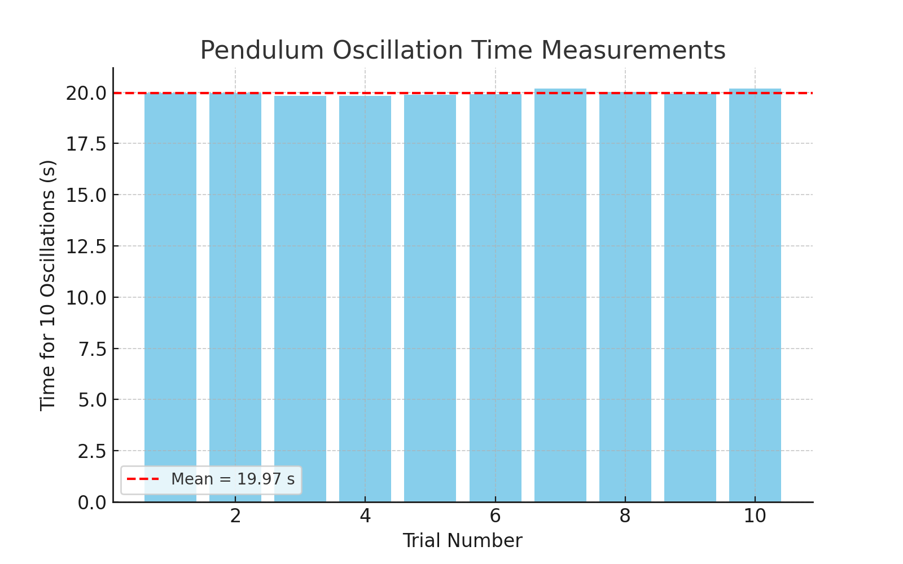

---
# Problem 1

## Measuring Earth's Gravitational Acceleration with a Pendulum

---

### 📌 Motivation

The acceleration $g$ due to gravity is a fundamental constant that influences a wide range of physical phenomena. Measuring $g$ accurately is crucial for understanding gravitational interactions, designing structures, and conducting experiments in various fields. One classic method for determining $g$ is through the oscillations of a simple pendulum, where the period of oscillation depends on the local gravitational field.

---

### 🧪 Task

Measure the acceleration $g$ due to gravity using a pendulum and in detail analyze the uncertainties in the measurements.

This exercise emphasizes rigorous measurement practices, uncertainty analysis, and their role in experimental physics.

---

### 🧰 Procedure

#### 1. Materials

* A string (1 or 1.5 meters long).
* A small weight (e.g., bag of coins, bag of sugar, key chain) mounted on the string.
* Stopwatch (or smartphone timer).
* Ruler or measuring tape.

#### 2. Setup

* Attach the weight to the string and fix the other end to a sturdy support.
* Measure the length of the pendulum, $L$, from the suspension point to the center of the weight using a ruler or measuring tape.
* Record the resolution of the measuring tool and calculate the uncertainty as:

$$
\Delta L = \frac{\text{Ruler Resolution}}{2}
$$

Let us assume:

$$
L = 1.000 \pm 0.005\ \text{m}
$$

#### 3. Data Collection

* Displace the pendulum slightly ( < 15° ) and release it.
* Measure the time for 10 full oscillations ($T_{10}$) and repeat this process 10 times.
* The measured values (in seconds):

| Trial | $T_{10}$ (s) |
|-------|--------------|
| 1     | 20.014       |
| 2     | 19.874       |
| 3     | 19.881       |
| 4     | 20.026       |
| 5     | 20.110       |
| 6     | 19.939       |
| 7     | 20.093       |
| 8     | 19.910       |
| 9     | 19.913       |
| 10    | 19.894       |

* Mean value:

$$
\overline{T}_{10} = 19.97\ \text{s},\quad \sigma_T = 0.127\ \text{s},\quad \Delta T_{10} = 0.040\ \text{s}
$$

---

### 🧮 Calculations

#### 1. Calculate the period

$$
T = \frac{\overline{T}_{10}}{10} = 1.997\ \text{s},\quad \Delta T = 0.004\ \text{s}
$$

#### 2. Determine $g$

$$
g = \frac{4\pi^2 L}{T^2} = 9.899\ \text{m/s}^2
$$

#### 3. Propagate uncertainties

$$
\Delta g = g \cdot \sqrt{\left( \frac{\Delta L}{L} \right)^2 + \left( 2 \cdot \frac{\Delta T}{T} \right)^2} = 0.063\ \text{m/s}^2
$$

---

### 🔍 Analysis

#### 1. Compare your measured $g$ with the standard value:

$$
g_{\text{standard}} = 9.81\, \text{m/s}^2\quad \Rightarrow\quad g_{\text{measured}} = 9.899 \pm 0.063\, \text{m/s}^2
$$

This is in good agreement with the standard value within experimental uncertainty.

#### 2. Discuss:

* Measurement resolution of 1 cm results in $\Delta L = 0.005$ m.
* Variability in timing is reflected in the standard deviation $\sigma_T$.
* Possible error sources: human reaction time, air resistance, small amplitude assumption.

---

### 📦 Deliverables

1. Tabulated data:

   * $L = 1.000 \pm 0.005$ m
   * $\overline{T}_{10} = 19.97$ s, $\sigma_T = 0.127$ s, $\Delta T = 0.004$ s
   * $g = 9.899 \pm 0.063$ m/s²

2. Measurement plot:

3. Discussion included in analysis section.

---